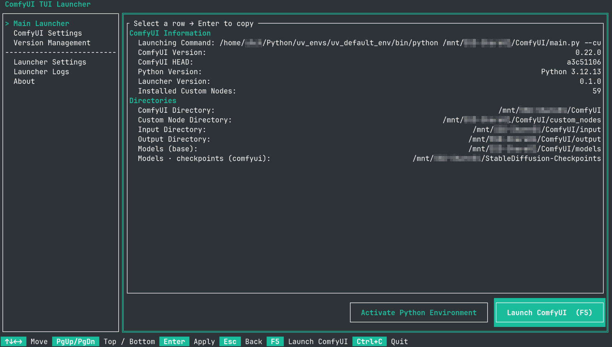

<h1 align="center">ComfyUI TUI Launcher</h1>

<p align="center">A simple ComfyUI TUI launcher that gives you complete control over ComfyUI from a terminal when GUI is not accessible.<br>Inspired by the launcher made by <a href="https://space.bilibili.com/12566101">秋葉aaaki@bilibili</a>.</p>

<p align="center"></p>

## Features

- **Works everywhere a terminal does** -- SSH sessions, Docker containers, headless servers, WSL, etc.
- **Full version management** -- Switch between stable release tags or any individual commit; update, rollback, enable, disable, or uninstall extensions one by one.
- **Portable version** -- Build with `--features portable` and everything the launcher owns lives under `<exe_dir>/local_data/`.
- **Mouse and keyboard** -- A full TUI with resize support; works with a mouse where the terminal allows it, fully operable by keyboard alone. Key bindings are provided below, which dynamically change according to the current focus, so that you do not need to remember any hotkeys.
- **i18n support** -- Switch the interface language instantly without restarting. Add your own by dropping a TOML file into `assets/i18n/`.
- **Mirrors and accelerations** -- Configure your own GitHub, Huggingface, etc. proxy/mirror endpoints.

## Installation

Prerequisites: a stable Rust toolchain (`rust-toolchain.toml` pins the exact version) and `git` on `PATH`.

```sh
# System install -- config lives in standard OS directories.
cargo build --release

# Portable -- config, cache, and logs live next to the binary.
cargo build --release --features portable
```

The binary lands at `target/release/comfyui-tui-launcher` (`.exe` on Windows). Copy it wherever you like.

## Configuration

| Mode     | Linux / macOS                          | Windows                                       |
|----------|----------------------------------------|------------------------------------------------|
| System   | `~/.config/comfyui-tui-launcher/`      | `%APPDATA%\comfyui-tui-launcher\`              |
| Portable | `<exe_dir>/local_data/config/`         | `<exe_dir>\local_data\config\`                 |

The launcher never touches your ComfyUI directory or model files; its own config is fully separate.
